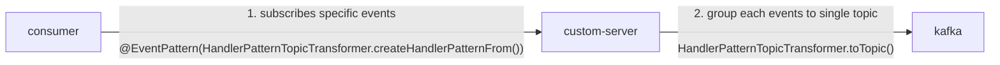
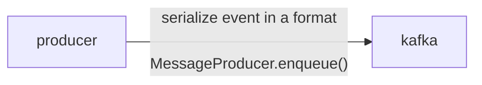
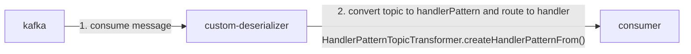

# nest-kafka

This repository contains some feasible solutions to resolve the problem of using NestJS microservice with Kafka.

## Grouping events

According to [Confluent](https://www.confluent.io/blog/put-several-event-types-kafka-topic/), it is recommended to group events about same entity in the same topic.
Managing fine-grained topics is not beneficial in terms of performance and clarity.

However, it is not easy to do that in NestJS microservice(using `@nestjs/microservices`). The reason is that NestJS microservice uses `@EventPattern` to subscribe events, and `@EventPattern` maps a event pattern to a single topic.

There is relative issue on [nestjs/nest Github](https://github.com/nestjs/nest/issues/6119). Kamil Mysliwiec, the creator of NestJS, suggests to have single method to subscribe single topic, which manage groups of event. Then broadcast another internal events using `@nestjs/event-emitter` package.

It is a possible solution, but doesn't seems elegant personally. Emitting internal event after consuming message from Kafka could make the system more complex and give difficulty to debug.

Here I came up with another solution. It is to use custom deserializer and server to convert topic to handler pattern and vice versa so that we can group multiple events in a single topic.

### start microservice

### publish

### consume

## Idempotent consumer

(TBD)
